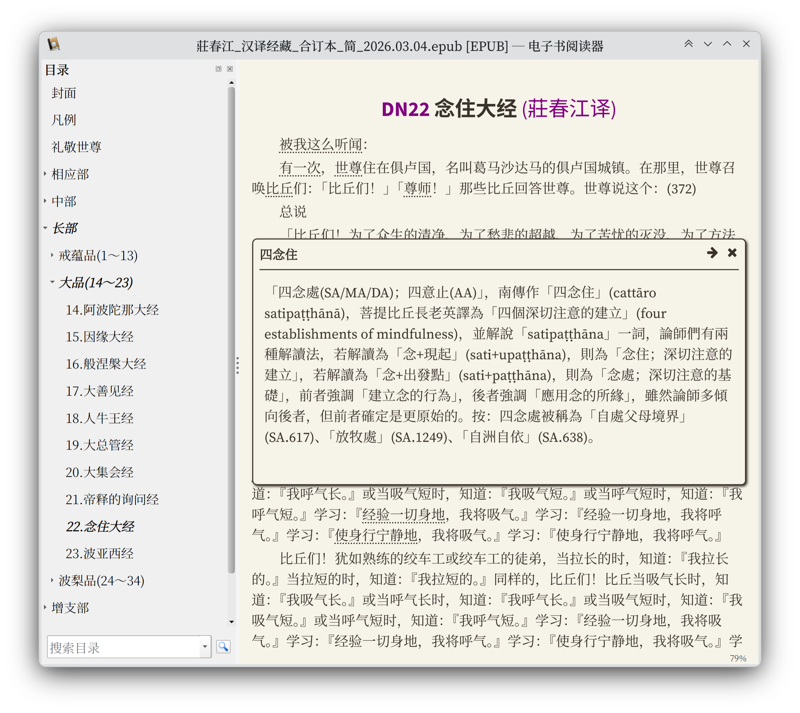
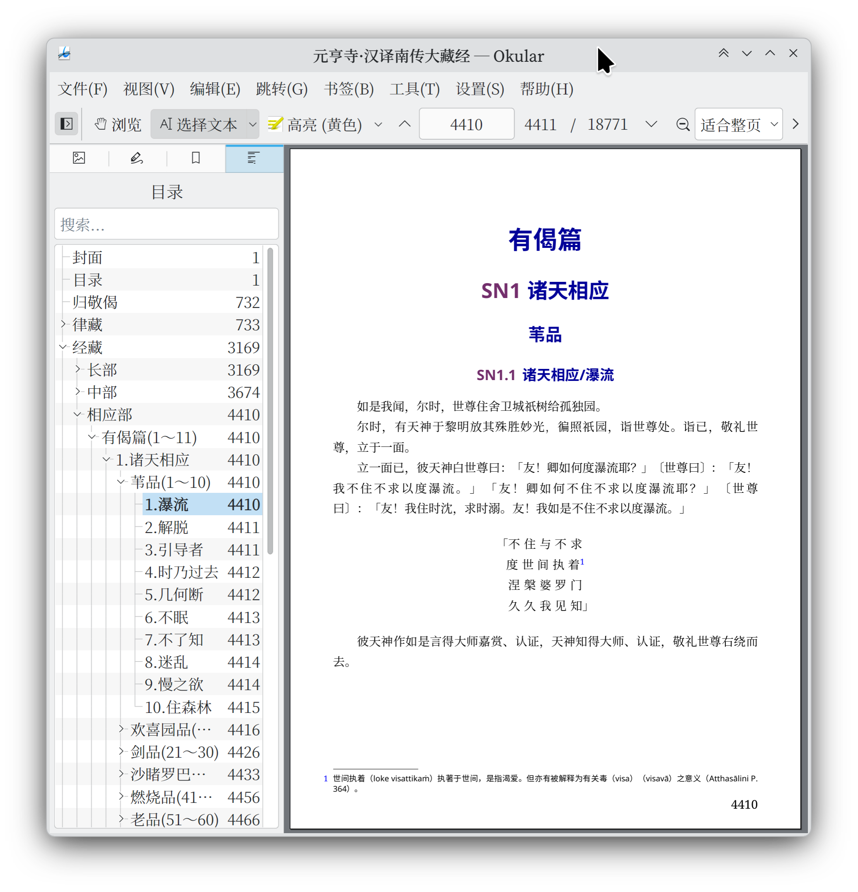

## 元亨寺汉译南传大藏经和莊春江汉译经藏电子书制作程序

这个程序制作了元亨寺版的汉译南传大藏经和大德莊春江的汉译经藏（不包含没有译完的本生经）的电子书。
程序大体过程是把 CBETA 的 xml-p5a 里的 N 目录，以及庄春江网站里南传经藏的 html 文件，转换成含有经文数据 XML 文件的目录树。
再把目录树转换成 EPUB3 和 PDF 电子书。

电子书有 EPUB3 和 PDF 两个格式。简体由程序转换而来，可能有错误的地方。

文件名带有 合订本 的压缩包是全部书籍在一个电子书里，其它的是分割开的电子书。

因为莊春江的译本包含的注解很多，而且每个注解都很详细，在 PDF 里以脚注方式呈现太占版面，
所以用 PDF 弹出注解的方式显示。请多试几个 PDF 阅读器测试最佳阅读体验。
开源免费的 **Okular** 阅读器阅读 PDF 注解效果令人满意，可以去 Microsoft Store 下载。

EPUB3 的格式的弹出注解如果不显示，请多试几个阅读器，推荐在电脑上使用 **Calibre** 软件里名为 **E-book viewer** 的程序阅读 EPUB3。

## 自己制作电子书
项目文件里已包含转换好的经文数据目录树。克隆项目，安装好依赖，就可以制作 EPUB 了。
制作 PDF 需要另外安装 ConTeXt 排版系统，以及各种字体，字体文件见 `tex/type-imp-myfonts-sc.tex` 和 `type-imp-myfonts-tc.tex`。

**制作全部电子书**，包含莊春江译本、元亨寺译本、合订本、分割本、EPUB、PDF、简体、繁体:  
``./write_ebooks.py onebook layouts=普通 fonts=宋 ``

**只制作元亨寺合订本 PDF 繁体版**：  
``./write_ebooks.py translations=y onebook books=none layouts=普通 fonts=宋 formats=pdf langs=tc``

**只制作莊春江相应部 EPUB 简体版**：  
``./write_ebooks.py translations=z books=sn langs=sc formats=epub``

# 已做好的**全部电子书**下载地址
1. 蓝奏云，密码 123456：https://wwaxq.lanzouv.com/b019vpg2hi
2. 坚果云，需要登录：https://www.jianguoyun.com/p/DbBOkGwQnbmtChjWkpIGIAA
3. Google 云盘：https://drive.google.com/drive/folders/1kCVtONm0Jq0LRz0Fp3WATg-F74dRGx4K?usp=sharing
